# JARKOM MODUL 2 2026 - K45

## Anggota

| Nama                         | NRP        |
| -------------                | ---------- |
| Abhista Athallah Dyfan       | 5027251006 |
| Rifqi Dwi Muslim             | 5027251077 |

---

## Topologi (GNS3)
 
Seluruh node host memakai **satu image Docker Debian yang sama** (DebiNet). Switch memakai **Ethernet switch** bawaan GNS3, dan gerbang internet memakai node **NAT** bawaan GNS3. Ikon yang berbeda-beda pada soal hanya simbol kosmetik, bukan jenis node yang berbeda.
 
**Daftar node:**
 
| Jumlah | Jenis node       | Node                                                                                                 |
| ------ | ---------------- | ---------------------------------------------------------------------------------------------------- |
| 14     | Docker (DebiNet) | rootkit, alpha, beta, gamma, delta, epsilon, abbey, penny, prab, tedd, obladi, desmond, oblada, molly |
| 7      | Ethernet switch  | Switch1, Switch2, Switch3, Switch4, Switch5, Switch6, Switch7                                        |
| 1      | NAT              | NAT                                                                                                  |
 
**rootkit diset memiliki 6 network adapter (eth0-eth5)** lewat Configure node dalam keadaan node berhenti. Node lain cukup 1 adapter (eth0, default).
 
**Daftar link:**
 
| Dari (node/eth) | Ke                             |
| --------------- | ------------------------------ |
| rootkit eth0    | NAT                            |
| rootkit eth1    | Switch6                        |
| rootkit eth2    | Switch7                        |
| rootkit eth3    | Switch4                        |
| rootkit eth4    | Switch5                        |
| rootkit eth5    | Switch1                        |
| Switch6         | alpha, beta, gamma             |
| Switch7         | delta, epsilon                 |
| Switch4         | abbey                          |
| Switch5         | penny                          |
| Switch1         | Switch2, Switch3               |
| Switch2         | prab, tedd                     |
| Switch3         | obladi, desmond, oblada, molly |
 
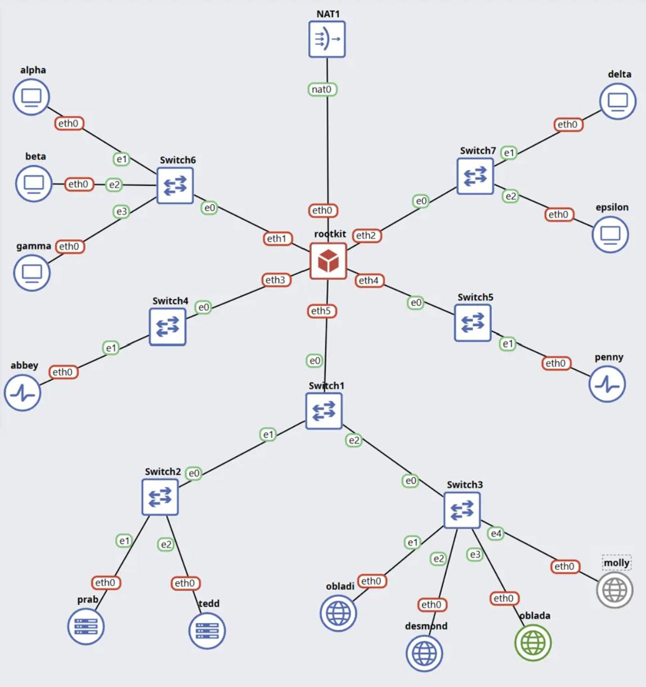
 
---
 
## Rancangan Pengalamatan IP
 
**Prefix kelompok: `10.86.x.x`**, domain kelompok: **`k45.com`**.
 
rootkit merentang ke **5 switch utama**, tiap switch menjadi satu subnet `/24`.
 
| Segmen (Switch)     | Subnet        | Gateway (di rootkit) | Node di segmen ini                         |
| ------------------- | ------------- | -------------------- | ------------------------------------------ |
| Switch6             | 10.86.1.0/24  | 10.86.1.1            | alpha, beta, gamma                         |
| Switch7             | 10.86.2.0/24  | 10.86.2.1            | delta, epsilon                             |
| Switch4             | 10.86.3.0/24  | 10.86.3.1            | abbey                                      |
| Switch5             | 10.86.4.0/24  | 10.86.4.1            | penny                                      |
| Switch1 → Switch2/3 | 10.86.5.0/24  | 10.86.5.1            | prab, tedd, obladi, desmond, oblada, molly |
 
**Alamat IP per node:**
 
| Node    | IP          | Netmask       | Gateway   | Peran                   |
| ------- | ----------- | ------------- | --------- | ----------------------- |
| rootkit | multi eth   | 255.255.255.0 | -         | Router / NAT            |
| alpha   | 10.86.1.2   | 255.255.255.0 | 10.86.1.1 | Client (pengamat)       |
| beta    | 10.86.1.3   | 255.255.255.0 | 10.86.1.1 | Client (pengamat)       |
| gamma   | 10.86.1.4   | 255.255.255.0 | 10.86.1.1 | Client (pengamat)       |
| delta   | 10.86.2.2   | 255.255.255.0 | 10.86.2.1 | Client (eksekutor)      |
| epsilon | 10.86.2.3   | 255.255.255.0 | 10.86.2.1 | Client (eksekutor)      |
| abbey   | 10.86.3.2   | 255.255.255.0 | 10.86.3.1 | Reverse proxy (statis)  |
| penny   | 10.86.4.2   | 255.255.255.0 | 10.86.4.1 | Reverse proxy (dinamis) |
| prab    | 10.86.5.2   | 255.255.255.0 | 10.86.5.1 | DNS ns1 (master)        |
| tedd    | 10.86.5.3   | 255.255.255.0 | 10.86.5.1 | DNS ns2 (slave)         |
| obladi  | 10.86.5.4   | 255.255.255.0 | 10.86.5.1 | Web statis (vault)      |
| desmond | 10.86.5.5   | 255.255.255.0 | 10.86.5.1 | Web statis (vault)      |
| oblada  | 10.86.5.6   | 255.255.255.0 | 10.86.5.1 | Web dinamis (core)      |
| molly   | 10.86.5.7   | 255.255.255.0 | 10.86.5.1 | Web dinamis (core)      |
 
**Pemetaan interface di rootkit:**
 
| Interface | Terhubung ke | IP        |
| --------- | ------------ | --------- |
| eth0      | NAT (WAN)    | dhcp      |
| eth1      | Switch6      | 10.86.1.1 |
| eth2      | Switch7      | 10.86.2.1 |
| eth3      | Switch4      | 10.86.3.1 |
| eth4      | Switch5      | 10.86.4.1 |
| eth5      | Switch1      | 10.86.5.1 |
 
---
 
## Urutan Pengerjaan
 
Seluruh konfigurasi dijalankan lewat **console tiap node** dan dijalankan berurutan seperti berikut, karena tiap tahap bergantung pada tahap sebelumnya:
 
1. **rootkit** dikonfigurasi lebih dulu (IP semua interface, forwarding, NAT), karena semua node lain membutuhkan jalur keluar untuk mengunduh paket.
2. **Node host** diberi IP, gateway, hostname, dan resolver awal.
3. **prab** dibangun sebagai DNS master, lalu **tedd** sebagai slave.
4. Resolver seluruh node non-router diarahkan ke prab, tedd, lalu 192.168.122.1.
5. **obladi, desmond** dijalankan sebagai web statis, **oblada, molly** sebagai web dinamis.
Verifikasi tiap tahap dilakukan sebelum lanjut ke tahap berikutnya. Untuk menjalankan seluruh konfigurasi sekaligus per node, lihat bagian **Blok Konfigurasi Lengkap per Node** di bagian akhir dokumen.
 
---
 
## Laporan
 
### Soal 1 - Pengalamatan IP dan Default Gateway
 
**Diminta:** menetapkan IP address dan *default gateway* untuk seluruh Entitas, mulai dari operator (alpha, beta, gamma), penjaga *directory* (prab, tedd), gerbang penyaring (abbey, penny), hingga *repository* (obladi, desmond, oblada, molly), sesuai prefix IP kelompok.
 
**Di rootkit**, tetapkan IP statis pada kelima interface yang mengarah ke switch:
 
```sh
cat <<'EOF' > /etc/network/interfaces
auto eth1
iface eth1 inet static
  address 10.86.1.1
  netmask 255.255.255.0
 
auto eth2
iface eth2 inet static
  address 10.86.2.1
  netmask 255.255.255.0
 
auto eth3
iface eth3 inet static
  address 10.86.3.1
  netmask 255.255.255.0
 
auto eth4
iface eth4 inet static
  address 10.86.4.1
  netmask 255.255.255.0
 
auto eth5
iface eth5 inet static
  address 10.86.5.1
  netmask 255.255.255.0
EOF
 
service networking restart
```
 
**Di tiap node host**, tetapkan IP statis beserta gateway segmennya. Blok berikut dijalankan di setiap node dengan **mengubah baris pertama saja** sesuai node yang sedang dikonfigurasi:
 
```sh
HOST=alpha; IP=10.86.1.2; GW=10.86.1.1
 
cat > /etc/network/interfaces <<EOF
auto eth0
iface eth0 inet static
  address $IP
  netmask 255.255.255.0
  gateway $GW
EOF
 
service networking restart
```
 
Nilai baris pertama untuk tiap node:
 
| Node    | Baris pertama                              |
| ------- | ------------------------------------------ |
| alpha   | `HOST=alpha; IP=10.86.1.2; GW=10.86.1.1`   |
| beta    | `HOST=beta; IP=10.86.1.3; GW=10.86.1.1`    |
| gamma   | `HOST=gamma; IP=10.86.1.4; GW=10.86.1.1`   |
| delta   | `HOST=delta; IP=10.86.2.2; GW=10.86.2.1`   |
| epsilon | `HOST=epsilon; IP=10.86.2.3; GW=10.86.2.1` |
| abbey   | `HOST=abbey; IP=10.86.3.2; GW=10.86.3.1`   |
| penny   | `HOST=penny; IP=10.86.4.2; GW=10.86.4.1`   |
| prab    | `HOST=prab; IP=10.86.5.2; GW=10.86.5.1`    |
| tedd    | `HOST=tedd; IP=10.86.5.3; GW=10.86.5.1`    |
| obladi  | `HOST=obladi; IP=10.86.5.4; GW=10.86.5.1`  |
| desmond | `HOST=desmond; IP=10.86.5.5; GW=10.86.5.1` |
| oblada  | `HOST=oblada; IP=10.86.5.6; GW=10.86.5.1`  |
| molly   | `HOST=molly; IP=10.86.5.7; GW=10.86.5.1`   |
 
**Verifikasi:**
 
```sh
ip a                      # di rootkit: eth1-eth5 memegang 10.86.x.1
ip a                      # di node host: eth0 memegang IP sesuai tabel
ping -c 2 10.86.1.1       # dari alpha ke gateway segmennya
```
 
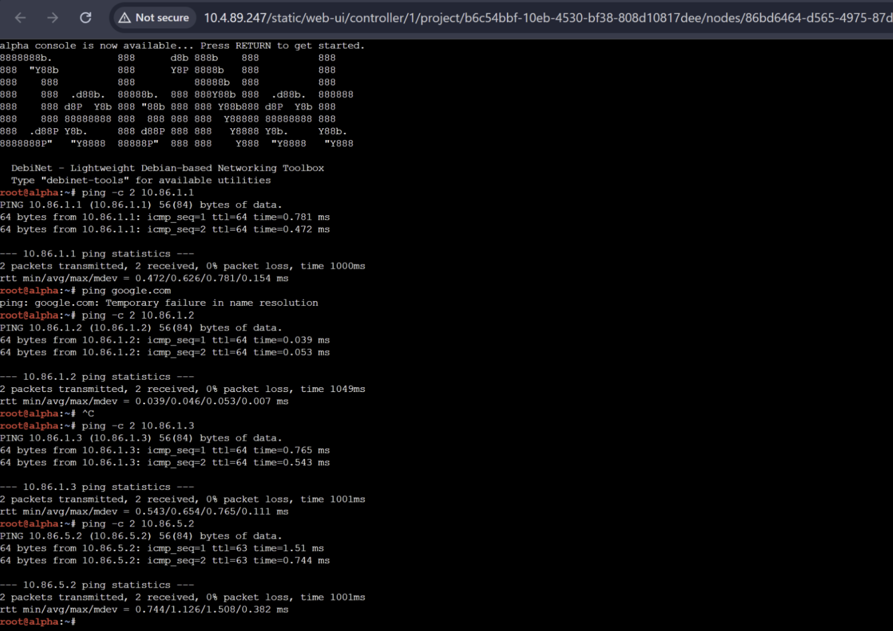

 
---
 
### Soal 2 - Jalur keluar melalui NAT
 
**Diminta:** membuka jalur menuju NAT dengan memastikan antarmuka WAN pada router rootkit aktif, lalu mengonfigurasi NAT agar meneruskan lalu lintas keluar bagi seluruh alamat internal.
 
**Di rootkit**, tambahkan antarmuka WAN yang mengambil alamat dari DHCP NAT:
 
```sh
cat <<'EOF' >> /etc/network/interfaces
 
auto eth0
iface eth0 inet dhcp
EOF
 
service networking restart
```
 
Aktifkan *IP forwarding* dan aturan *masquerade*:
 
```sh
echo 1 > /proc/sys/net/ipv4/ip_forward
 
which iptables >/dev/null 2>&1 || (apt update && apt install iptables -y)
 
iptables -t nat -C POSTROUTING -o eth0 -j MASQUERADE -s 10.86.0.0/16 2>/dev/null || \
iptables -t nat -A POSTROUTING -o eth0 -j MASQUERADE -s 10.86.0.0/16
```
 
Penjelasan aturan `iptables`:
 
- `-t nat` : tabel NAT untuk translasi alamat pada lalu lintas keluar
- `-A POSTROUTING` : aturan diterapkan pada paket yang akan meninggalkan sistem
- `-o eth0` : antarmuka keluar, yaitu yang mengarah ke NAT
- `-j MASQUERADE` : alamat sumber paket diganti dengan alamat eth0 rootkit
- `-s 10.86.0.0/16` : hanya berlaku bagi paket yang berasal dari subnet internal kelompok
**Catatan:** `ip_forward` dan aturan `iptables` bersifat *runtime*, keduanya dijalankan kembali setiap kali node rootkit dinyalakan.
 
**Verifikasi:**
 
```sh
ip a                      # eth0 mendapat alamat 192.168.122.x dari NAT
ping -c 3 google.com      # dari rootkit
```
 
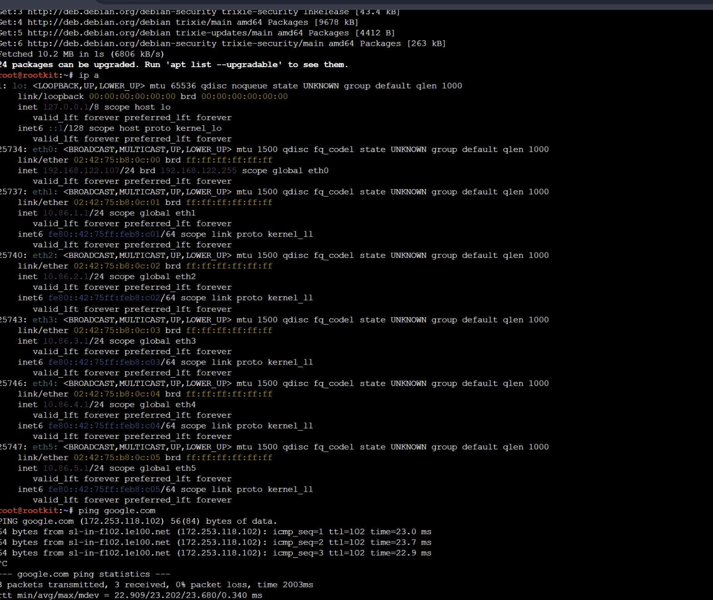
 
---
 
### Soal 3 - Sinkronisasi antar divisi dan resolver awal
 
**Diminta:** memastikan seluruh Entitas dapat saling terhubung dan berkomunikasi lintas jalur (routing internal via rootkit berfungsi), serta setiap host non-router menambahkan resolver `192.168.122.1` pada `/etc/resolv.conf` agar akses pengunduhan paket tersedia sejak awal. Resolver Google tidak digunakan.
 
Routing internal berjalan otomatis setelah rootkit memegang alamat di semua segmen (soal 1) dan *forwarding* aktif (soal 2), sehingga tiap segmen dapat menjangkau segmen lain melalui rootkit.
 
**Di tiap node non-router**, tetapkan resolver awal:
 
```sh
echo "nameserver 192.168.122.1" > /etc/resolv.conf
```
 
**Verifikasi** dari alpha, mencakup komunikasi lintas segmen dan akses keluar:
 
```sh
ping -c 3 10.86.2.2       # delta, segmen berbeda
ping -c 3 10.86.5.2       # prab, segmen berbeda
ping -c 3 google.com      # akses keluar melalui rootkit
```
 
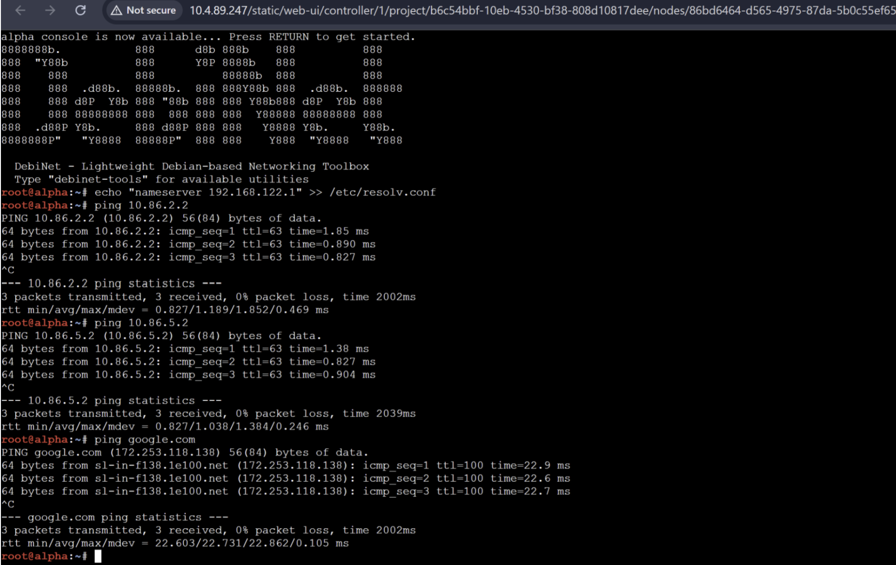

 
---
 
### Soal 4 - Zona k45.com pada prab (ns1) dan tedd (ns2)
 
**Diminta:** pada node **prab**, membangun zona `k45.com` sebagai *authoritative* dengan SOA yang menunjuk ke `prab.k45.com`, menambahkan catatan NS untuk `prab.k45.com` dan `tedd.k45.com`, membuat A record untuk keduanya, serta A record *apex* `k45.com` yang mengarah ke gerbang aplikasi dinamis (**penny**). Fitur *notify* dan *allow-transfer* ke tedd diaktifkan, dan *forwarders* diarahkan ke `192.168.122.1`. Pada node **tedd**, zona `k45.com` ditarik dari master dan dijawab secara *authoritative*. Setelah itu urutan resolver pada seluruh Entitas non-router diperbarui menjadi IP **prab**, IP **tedd**, lalu `192.168.122.1`.
 
**Di prab**, pasang bind9 dan siapkan direktori zona:
 
```sh
apt update
apt install bind9 dnsutils -y
mkdir -p /etc/bind/zones
```
 
Berkas `/etc/bind/named.conf.options`:
 
```sh
cat <<'EOF' > /etc/bind/named.conf.options
options {
    directory "/var/cache/bind";
    recursion yes;
    allow-query { any; };
    forwarders { 192.168.122.1; };
    dnssec-validation no;
};
EOF
```
 
Berkas `/etc/bind/named.conf.local`, mendeklarasikan zona sebagai master sekaligus mengizinkan transfer ke tedd:
 
```sh
cat <<'EOF' > /etc/bind/named.conf.local
zone "k45.com" {
    type master;
    file "/etc/bind/zones/db.k45.com";
    allow-transfer { 10.86.5.3; };
    also-notify { 10.86.5.3; };
    notify yes;
};
EOF
```
 
Berkas zona `/etc/bind/zones/db.k45.com`:
 
```sh
cat <<'EOF' > /etc/bind/zones/db.k45.com
$TTL 604800
@   IN  SOA prab.k45.com. admin.k45.com. (
        2026092801  ; Serial
        604800      ; Refresh
        86400       ; Retry
        2419200     ; Expire
        604800 )    ; Negative Cache TTL
;
@       IN  NS  prab.k45.com.
@       IN  NS  tedd.k45.com.
@       IN  A   10.86.4.2
prab    IN  A   10.86.5.2
tedd    IN  A   10.86.5.3
EOF
```
 
Baris `@ IN A 10.86.4.2` adalah A record *apex*, mengarahkan `k45.com` ke **penny** sebagai gerbang aplikasi dinamis.
 
Validasi lalu jalankan layanan:
 
```sh
named-checkconf
named-checkzone k45.com /etc/bind/zones/db.k45.com
service named restart || service bind9 restart
```
 
**Di tedd**, pasang bind9 dan deklarasikan zona sebagai slave:
 
```sh
apt update
apt install bind9 dnsutils -y
 
cat <<'EOF' > /etc/bind/named.conf.options
options {
    directory "/var/cache/bind";
    recursion yes;
    allow-query { any; };
    forwarders { 192.168.122.1; };
    dnssec-validation no;
};
EOF
 
cat <<'EOF' > /etc/bind/named.conf.local
zone "k45.com" {
    type slave;
    masters { 10.86.5.2; };
    file "/var/cache/bind/db.k45.com";
};
EOF
 
named-checkconf
service named restart || service bind9 restart
```
 
**Perbarui urutan resolver di seluruh node non-router**, termasuk prab dan tedd sendiri:
 
```sh
cat <<'EOF' > /etc/resolv.conf
nameserver 10.86.5.2
nameserver 10.86.5.3
nameserver 192.168.122.1
EOF
```
 
**Verifikasi:**
 
```sh
dig @10.86.5.2 k45.com SOA +short   # prab menjawab sebagai authoritative
dig @10.86.5.3 k45.com SOA +short   # tedd menjawab dengan serial yang sama
dig k45.com +short                  # 10.86.4.2 (penny)
dig prab.k45.com +short             # 10.86.5.2
```
 


 
---
 
### Soal 5 - Penamaan Entitas dan domain per node
 
**Diminta:** menamai seluruh Entitas (*hostname*) sesuai glosarium dan memverifikasi setiap host mengenali *hostname* tersebut secara *system-wide*, serta membuat domain untuk masing-masing node sesuai namanya (contoh `alpha.k45.com`) dengan IP masing-masing. Node prab dan tedd dikecualikan karena sudah dibuat pada soal sebelumnya.
 
**Di tiap node**, tetapkan *hostname*. Blok berikut dijalankan pada setiap node dengan mengganti nilai `HOST` sesuai nama node:
 
```sh
HOST=alpha
 
hostname $HOST
echo $HOST > /etc/hostname
grep -q "127.0.1.1 $HOST" /etc/hosts || echo "127.0.1.1 $HOST" >> /etc/hosts
```
 
Nilai `HOST` untuk tiap node: `rootkit`, `alpha`, `beta`, `gamma`, `delta`, `epsilon`, `abbey`, `penny`, `prab`, `tedd`, `obladi`, `desmond`, `oblada`, `molly`.
 
**Di prab**, tambahkan A record seluruh node ke berkas zona. Berkas ditulis ulang secara utuh dengan **nilai Serial dinaikkan** menjadi `2026092802`:
 
```sh
cat <<'EOF' > /etc/bind/zones/db.k45.com
$TTL 604800
@   IN  SOA prab.k45.com. admin.k45.com. (
        2026092802
        604800
        86400
        2419200
        604800 )
;
@       IN  NS  prab.k45.com.
@       IN  NS  tedd.k45.com.
@       IN  A   10.86.4.2
prab    IN  A   10.86.5.2
tedd    IN  A   10.86.5.3
rootkit IN  A   10.86.5.1
alpha   IN  A   10.86.1.2
beta    IN  A   10.86.1.3
gamma   IN  A   10.86.1.4
delta   IN  A   10.86.2.2
epsilon IN  A   10.86.2.3
abbey   IN  A   10.86.3.2
penny   IN  A   10.86.4.2
obladi  IN  A   10.86.5.4
desmond IN  A   10.86.5.5
oblada  IN  A   10.86.5.6
molly   IN  A   10.86.5.7
EOF
 
named-checkzone k45.com /etc/bind/zones/db.k45.com
service named restart || service bind9 restart
```
 
**Nilai Serial dinaikkan setiap kali berkas zona diubah**, karena tedd hanya menarik salinan baru bila Serial pada master lebih besar daripada salinan yang dipegangnya.
 
**Verifikasi:**
 
```sh
hostname                        # dijalankan di beberapa node berbeda
dig alpha.k45.com +short        # 10.86.1.2
dig molly.k45.com +short        # 10.86.5.7
dig abbey.k45.com +short        # 10.86.3.2
```
 
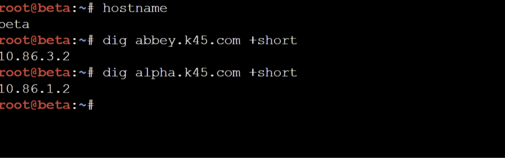
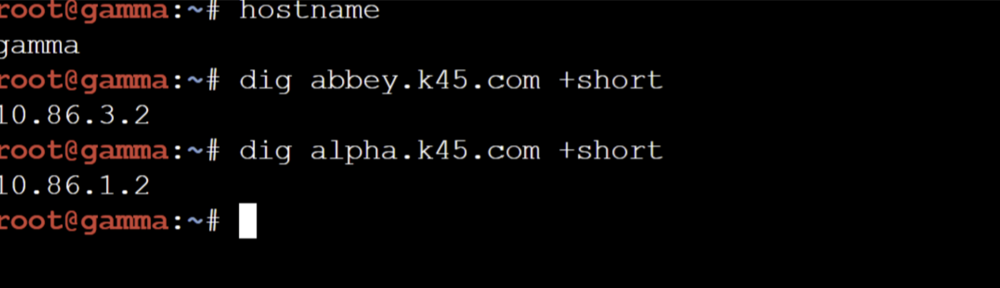
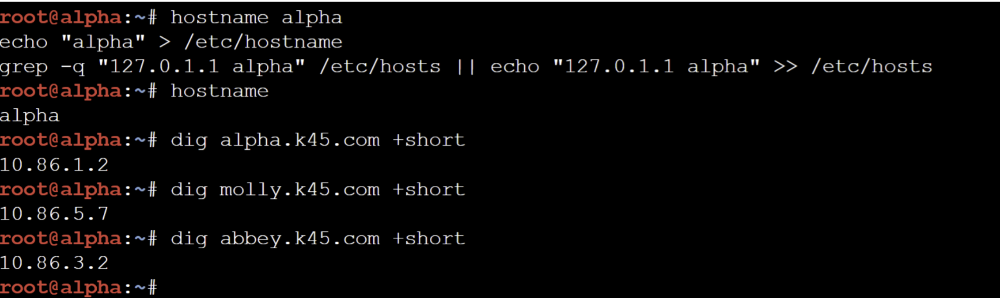
 
---
 
### Soal 6 - Zone transfer prab ke tedd
 
**Diminta:** memastikan *zone transfer* berjalan dan tedd telah menerima salinan zona terbaru dari prab, dengan nilai Serial SOA pada keduanya harus sama.
 
Bandingkan Serial pada kedua server:
 
```sh
dig @10.86.5.2 k45.com SOA +short
dig @10.86.5.3 k45.com SOA +short
```
 
**Di tedd**, tarik seluruh isi zona dari master dan pastikan berkas salinan terbentuk:
 
```sh
dig @10.86.5.2 k45.com AXFR
ls -l /var/cache/bind/db.k45.com
```
 
Permintaan AXFR hanya dilayani untuk alamat yang terdaftar pada `allow-transfer`, sehingga perintah tersebut dijalankan dari tedd, bukan dari node client.
 
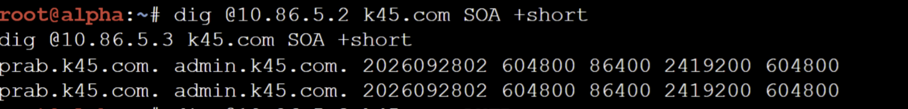
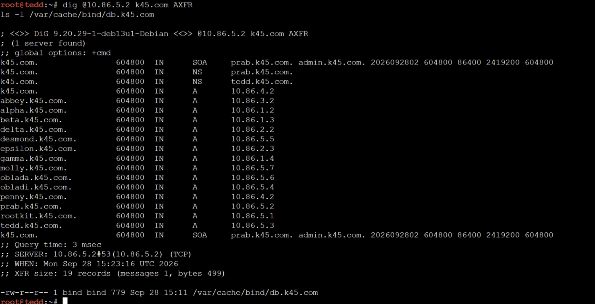
 
---
 
### Soal 7 - Endpoint area vault, area core, dan CNAME
 
**Diminta:** abbey dan penny sebagai gerbang utama, obladi dan desmond sebagai web statis, oblada dan molly sebagai web dinamis. Pada zona `k45.com` ditambahkan A record untuk `vault.k45.com` (IP obladi dan desmond) serta `core.k45.com` (IP oblada dan molly), ditambah CNAME `www.k45.com` → `penny.k45.com` dan `static.k45.com` → `abbey.k45.com`. Verifikasi dilakukan dari dua klien berbeda dan hasilnya harus konsisten.
 
**Di prab**, tulis ulang berkas zona dengan tambahan *endpoint* web dan **Serial dinaikkan** menjadi `2026092803`:
 
```sh
cat <<'EOF' > /etc/bind/zones/db.k45.com
$TTL 604800
@   IN  SOA prab.k45.com. admin.k45.com. (
        2026092803
        604800
        86400
        2419200
        604800 )
;
@       IN  NS  prab.k45.com.
@       IN  NS  tedd.k45.com.
@       IN  A   10.86.4.2
prab    IN  A   10.86.5.2
tedd    IN  A   10.86.5.3
rootkit IN  A   10.86.5.1
alpha   IN  A   10.86.1.2
beta    IN  A   10.86.1.3
gamma   IN  A   10.86.1.4
delta   IN  A   10.86.2.2
epsilon IN  A   10.86.2.3
abbey   IN  A   10.86.3.2
penny   IN  A   10.86.4.2
obladi  IN  A   10.86.5.4
desmond IN  A   10.86.5.5
oblada  IN  A   10.86.5.6
molly   IN  A   10.86.5.7
vault   IN  A       10.86.5.4
vault   IN  A       10.86.5.5
core    IN  A       10.86.5.6
core    IN  A       10.86.5.7
www     IN  CNAME   penny.k45.com.
static  IN  CNAME   abbey.k45.com.
EOF
 
named-checkzone k45.com /etc/bind/zones/db.k45.com
service named restart || service bind9 restart
```
 
`vault` dan `core` masing-masing memiliki dua A record, sehingga permintaan ke nama tersebut dijawab bergantian ke kedua node anggotanya.
 
**Verifikasi dari dua klien berbeda**, misalnya alpha dan delta. Kedua klien harus menghasilkan tujuan yang sama:
 
```sh
dig vault.k45.com +short     # 10.86.5.4 dan 10.86.5.5
dig core.k45.com +short      # 10.86.5.6 dan 10.86.5.7
dig www.k45.com +short       # penny.k45.com. lalu 10.86.4.2
dig static.k45.com +short    # abbey.k45.com. lalu 10.86.3.2
```
 
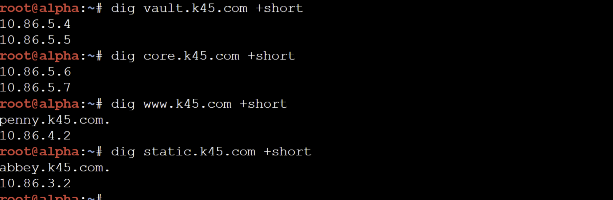
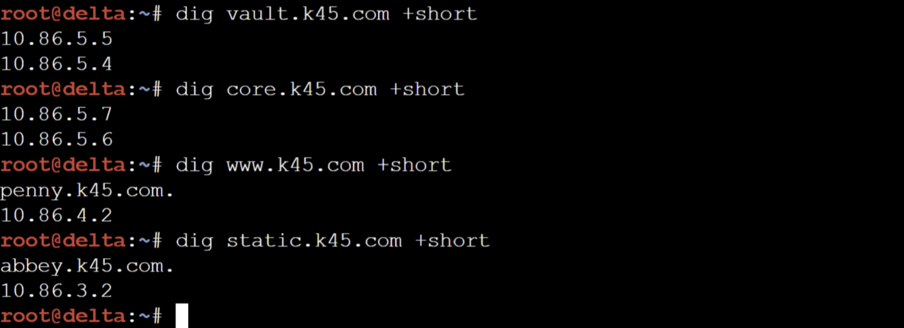
 
---
 
### Soal 8 - Reverse zone dan PTR
 
**Diminta:** pada **prab (ns1)** dideklarasikan *reverse zone* untuk segmen tempat abbey, penny, area vault, dan area core berada. Pada **tedd (ns2)** *reverse zone* tersebut ditarik sebagai *slave*, dengan PTR untuk keempat hostname tersebut agar pencarian balik alamat IP mengembalikan hostname yang benar dan dijawab secara *authoritative*.
 
Node yang dimaksud tersebar pada tiga segmen, sehingga dibuat **tiga reverse zone**:
 
- abbey berada di `10.86.3.0/24` → zona `3.86.10.in-addr.arpa`
- penny berada di `10.86.4.0/24` → zona `4.86.10.in-addr.arpa`
- area vault dan area core berada di `10.86.5.0/24` → zona `5.86.10.in-addr.arpa`
**Di prab**, tambahkan deklarasi ketiga zona. Perintah memakai `>>` agar zona `k45.com` yang sudah ada tidak tertimpa:
 
```sh
cat <<'EOF' >> /etc/bind/named.conf.local
 
zone "3.86.10.in-addr.arpa" {
    type master;
    file "/etc/bind/zones/db.10.86.3";
    allow-transfer { 10.86.5.3; };
    also-notify { 10.86.5.3; };
    notify yes;
};
zone "4.86.10.in-addr.arpa" {
    type master;
    file "/etc/bind/zones/db.10.86.4";
    allow-transfer { 10.86.5.3; };
    also-notify { 10.86.5.3; };
    notify yes;
};
zone "5.86.10.in-addr.arpa" {
    type master;
    file "/etc/bind/zones/db.10.86.5";
    allow-transfer { 10.86.5.3; };
    also-notify { 10.86.5.3; };
    notify yes;
};
EOF
```
 
Berkas ketiga zona, dengan angka di kolom kiri merupakan oktet terakhir alamat IP:
 
```sh
cat <<'EOF' > /etc/bind/zones/db.10.86.3
$TTL 604800
@   IN  SOA prab.k45.com. admin.k45.com. (
        2026092801 604800 86400 2419200 604800 )
@   IN  NS  prab.k45.com.
@   IN  NS  tedd.k45.com.
2   IN  PTR abbey.k45.com.
EOF
 
cat <<'EOF' > /etc/bind/zones/db.10.86.4
$TTL 604800
@   IN  SOA prab.k45.com. admin.k45.com. (
        2026092801 604800 86400 2419200 604800 )
@   IN  NS  prab.k45.com.
@   IN  NS  tedd.k45.com.
2   IN  PTR penny.k45.com.
EOF
 
cat <<'EOF' > /etc/bind/zones/db.10.86.5
$TTL 604800
@   IN  SOA prab.k45.com. admin.k45.com. (
        2026092801 604800 86400 2419200 604800 )
@   IN  NS  prab.k45.com.
@   IN  NS  tedd.k45.com.
4   IN  PTR obladi.k45.com.
5   IN  PTR desmond.k45.com.
6   IN  PTR oblada.k45.com.
7   IN  PTR molly.k45.com.
EOF
```
 
Validasi dan jalankan ulang layanan:
 
```sh
named-checkconf
named-checkzone 3.86.10.in-addr.arpa /etc/bind/zones/db.10.86.3
named-checkzone 4.86.10.in-addr.arpa /etc/bind/zones/db.10.86.4
named-checkzone 5.86.10.in-addr.arpa /etc/bind/zones/db.10.86.5
service named restart || service bind9 restart
```
 
**Di tedd**, tarik ketiga zona sebagai slave:
 
```sh
cat <<'EOF' >> /etc/bind/named.conf.local
 
zone "3.86.10.in-addr.arpa" {
    type slave;
    masters { 10.86.5.2; };
    file "/var/cache/bind/db.10.86.3";
};
zone "4.86.10.in-addr.arpa" {
    type slave;
    masters { 10.86.5.2; };
    file "/var/cache/bind/db.10.86.4";
};
zone "5.86.10.in-addr.arpa" {
    type slave;
    masters { 10.86.5.2; };
    file "/var/cache/bind/db.10.86.5";
};
EOF
 
named-checkconf
service named restart || service bind9 restart
```
 
**Verifikasi:**
 
```sh
dig -x 10.86.3.2 +short              # abbey.k45.com.
dig -x 10.86.4.2 +short              # penny.k45.com.
dig -x 10.86.5.4 +short              # obladi.k45.com.
dig -x 10.86.5.5 +short              # desmond.k45.com.
dig -x 10.86.5.6 +short              # oblada.k45.com.
dig -x 10.86.5.7 +short              # molly.k45.com.
dig @10.86.5.3 -x 10.86.5.7 +short   # tedd juga menjawab
```
 
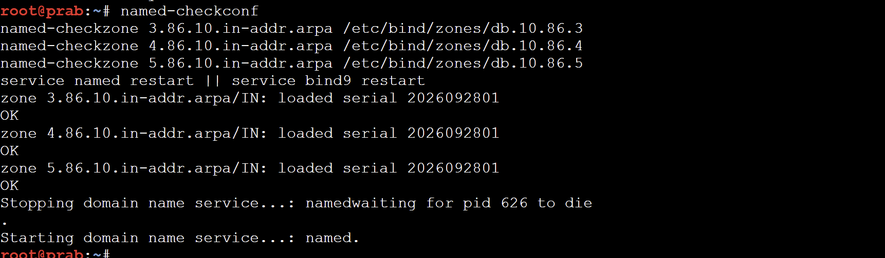
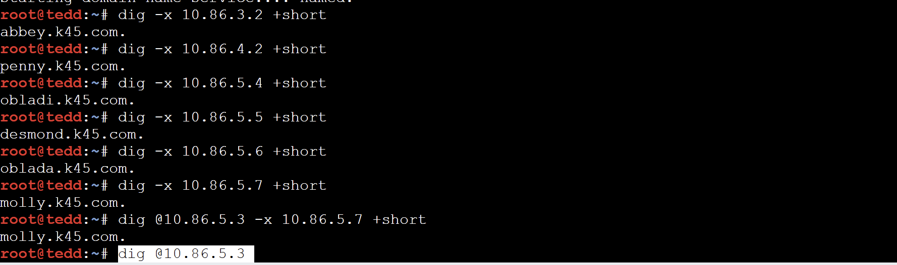
 
---
 
### Soal 9 - Web statis dengan autoindex pada area vault
 
**Diminta:** menjalankan layanan web statis pada hostname di node **area vault** menggunakan Apache, membuka direktori `/arsip/` dan mengaktifkan fitur **autoindex (directory listing)** pada konfigurasi Apache sehingga seluruh daftar berkas di dalamnya dapat ditelusuri langsung dari browser. Akses pengujian dilakukan melalui hostname, bukan IP address.
 
Blok berikut dijalankan di **obladi** dan **desmond**, isinya identik:
 
```sh
apt update
apt install apache2 -y
 
mkdir -p /var/www/html/arsip
echo "Arsip $(hostname) - dokumen 1" > /var/www/html/arsip/dokumen1.txt
echo "Arsip $(hostname) - dokumen 2" > /var/www/html/arsip/dokumen2.txt
echo "Arsip $(hostname) - catatan"   > /var/www/html/arsip/catatan.txt
 
cat <<'EOF' > /etc/apache2/conf-available/arsip.conf
<Directory /var/www/html/arsip>
    Options +Indexes
    AllowOverride None
    Require all granted
</Directory>
EOF
 
a2enmod autoindex
a2enconf arsip
service apache2 restart
```
 
`Options +Indexes` adalah bagian yang membuat isi direktori ditampilkan sebagai daftar ketika tidak ada berkas indeks di dalamnya.
 
**Verifikasi** dari node client, seluruhnya melalui hostname:
 
```sh
curl http://vault.k45.com/arsip/
curl http://obladi.k45.com/arsip/
curl http://desmond.k45.com/arsip/
```
 
Pengujian melalui browser dibuka pada alamat `http://vault.k45.com/arsip/`.
 

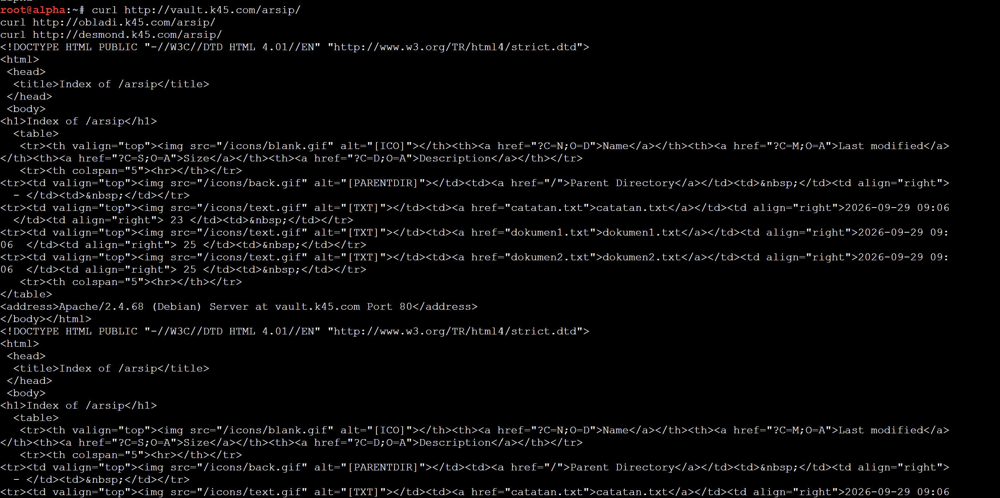
 
---
 
### Soal 10 - Web dinamis PHP-FPM dengan URL bersih pada area core
 
**Diminta:** menjalankan layanan web dinamis (PHP-FPM) pada hostname di node **area core** menggunakan nginx, membuat aplikasi sederhana yang memuat halaman **beranda** dan halaman **profil**, serta menerapkan aturan *rewrite* pada server sehingga akses ke `/profil` berfungsi dengan URL bersih (**tanpa akhiran .php**). Akses pengujian dilakukan melalui hostname.
 
Blok berikut dijalankan di **oblada** dan **molly**, isinya identik. Nama *socket* PHP-FPM dideteksi otomatis agar sesuai dengan versi yang terpasang:
 
```sh
apt update
apt install nginx php-fpm -y
 
cat <<'EOF' > /var/www/html/index.php
<?php
echo "<h1>Beranda - " . gethostname() . "</h1>";
echo "<p>Area core, layanan web dinamis k45.com</p>";
echo "<a href='/profil'>Lihat Profil</a>";
?>
EOF
 
cat <<'EOF' > /var/www/html/profil.php
<?php
echo "<h1>Profil - " . gethostname() . "</h1>";
echo "<p>Halaman ini diakses tanpa akhiran .php</p>";
echo "<a href='/'>Kembali ke beranda</a>";
?>
EOF
 
PHPSOCK=$(ls /run/php/php*-fpm.sock | head -1)
 
cat > /etc/nginx/sites-available/default <<EOF
server {
    listen 80 default_server;
    root /var/www/html;
    index index.php index.html;
    server_name core.k45.com oblada.k45.com molly.k45.com;
 
    location / {
        try_files \$uri \$uri/ @extensionless;
    }
 
    location @extensionless {
        rewrite ^(.*)\$ \$1.php last;
    }
 
    location ~ \.php\$ {
        include snippets/fastcgi-php.conf;
        fastcgi_pass unix:$PHPSOCK;
    }
}
EOF
 
nginx -t
service php8.4-fpm restart 2>/dev/null || service php-fpm restart 2>/dev/null || true
service nginx restart
```
 
Mekanisme URL bersih berada pada dua blok lokasi. Permintaan yang tidak cocok dengan berkas apa pun dilempar ke `@extensionless`, lalu di sana ditulis ulang dengan menambahkan akhiran `.php` secara internal, sehingga `/profil` dilayani oleh `profil.php` tanpa terlihat pada URL.
 
**Verifikasi** melalui hostname:
 
```sh
curl http://core.k45.com/
curl http://core.k45.com/profil
curl http://oblada.k45.com/profil
curl http://molly.k45.com/profil
```
 
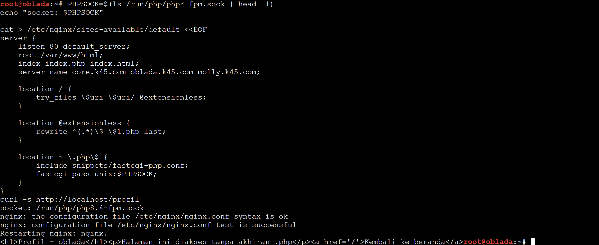
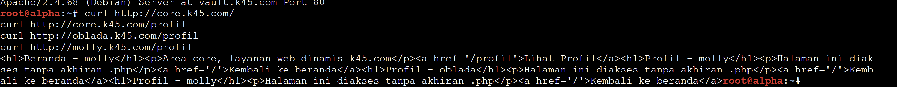
 
---
 
## Blok Konfigurasi Lengkap per Node
 
Bagian ini memuat seluruh konfigurasi tiap node dalam satu blok utuh, mencakup soal 1 sampai 10. Blok dijalankan pada console node yang bersangkutan dan dapat dijalankan berulang kali tanpa efek samping.
 
**Urutan menjalankan: rootkit → prab → tedd → node host → node web.** rootkit didahulukan karena node lain membutuhkan jalur keluar untuk mengunduh paket, dan prab didahulukan sebelum node yang memakai nama domain.
 
### rootkit
 
```sh
hostname rootkit
echo rootkit > /etc/hostname
grep -q "127.0.1.1 rootkit" /etc/hosts || echo "127.0.1.1 rootkit" >> /etc/hosts
 
cat <<'EOF' > /etc/network/interfaces
auto eth0
iface eth0 inet dhcp
 
auto eth1
iface eth1 inet static
  address 10.86.1.1
  netmask 255.255.255.0
 
auto eth2
iface eth2 inet static
  address 10.86.2.1
  netmask 255.255.255.0
 
auto eth3
iface eth3 inet static
  address 10.86.3.1
  netmask 255.255.255.0
 
auto eth4
iface eth4 inet static
  address 10.86.4.1
  netmask 255.255.255.0
 
auto eth5
iface eth5 inet static
  address 10.86.5.1
  netmask 255.255.255.0
EOF
 
service networking restart
 
echo 1 > /proc/sys/net/ipv4/ip_forward
which iptables >/dev/null 2>&1 || (apt update && apt install iptables -y)
iptables -t nat -C POSTROUTING -o eth0 -j MASQUERADE -s 10.86.0.0/16 2>/dev/null || \
iptables -t nat -A POSTROUTING -o eth0 -j MASQUERADE -s 10.86.0.0/16
 
ping -c 2 google.com
```
 
### prab (DNS master, zona forward dan reverse)
 
```sh
hostname prab
echo prab > /etc/hostname
grep -q "127.0.1.1 prab" /etc/hosts || echo "127.0.1.1 prab" >> /etc/hosts
 
cat <<'EOF' > /etc/network/interfaces
auto eth0
iface eth0 inet static
  address 10.86.5.2
  netmask 255.255.255.0
  gateway 10.86.5.1
EOF
service networking restart
 
echo "nameserver 192.168.122.1" > /etc/resolv.conf
apt update
apt install bind9 dnsutils -y
mkdir -p /etc/bind/zones
 
cat <<'EOF' > /etc/bind/named.conf.options
options {
    directory "/var/cache/bind";
    recursion yes;
    allow-query { any; };
    forwarders { 192.168.122.1; };
    dnssec-validation no;
};
EOF
 
cat <<'EOF' > /etc/bind/named.conf.local
zone "k45.com" {
    type master;
    file "/etc/bind/zones/db.k45.com";
    allow-transfer { 10.86.5.3; };
    also-notify { 10.86.5.3; };
    notify yes;
};
zone "3.86.10.in-addr.arpa" {
    type master;
    file "/etc/bind/zones/db.10.86.3";
    allow-transfer { 10.86.5.3; };
    also-notify { 10.86.5.3; };
    notify yes;
};
zone "4.86.10.in-addr.arpa" {
    type master;
    file "/etc/bind/zones/db.10.86.4";
    allow-transfer { 10.86.5.3; };
    also-notify { 10.86.5.3; };
    notify yes;
};
zone "5.86.10.in-addr.arpa" {
    type master;
    file "/etc/bind/zones/db.10.86.5";
    allow-transfer { 10.86.5.3; };
    also-notify { 10.86.5.3; };
    notify yes;
};
EOF
 
cat <<'EOF' > /etc/bind/zones/db.k45.com
$TTL 604800
@   IN  SOA prab.k45.com. admin.k45.com. (
        2026092803
        604800
        86400
        2419200
        604800 )
;
@       IN  NS  prab.k45.com.
@       IN  NS  tedd.k45.com.
@       IN  A   10.86.4.2
prab    IN  A   10.86.5.2
tedd    IN  A   10.86.5.3
rootkit IN  A   10.86.5.1
alpha   IN  A   10.86.1.2
beta    IN  A   10.86.1.3
gamma   IN  A   10.86.1.4
delta   IN  A   10.86.2.2
epsilon IN  A   10.86.2.3
abbey   IN  A   10.86.3.2
penny   IN  A   10.86.4.2
obladi  IN  A   10.86.5.4
desmond IN  A   10.86.5.5
oblada  IN  A   10.86.5.6
molly   IN  A   10.86.5.7
vault   IN  A       10.86.5.4
vault   IN  A       10.86.5.5
core    IN  A       10.86.5.6
core    IN  A       10.86.5.7
www     IN  CNAME   penny.k45.com.
static  IN  CNAME   abbey.k45.com.
EOF
 
cat <<'EOF' > /etc/bind/zones/db.10.86.3
$TTL 604800
@   IN  SOA prab.k45.com. admin.k45.com. (
        2026092801 604800 86400 2419200 604800 )
@   IN  NS  prab.k45.com.
@   IN  NS  tedd.k45.com.
2   IN  PTR abbey.k45.com.
EOF
 
cat <<'EOF' > /etc/bind/zones/db.10.86.4
$TTL 604800
@   IN  SOA prab.k45.com. admin.k45.com. (
        2026092801 604800 86400 2419200 604800 )
@   IN  NS  prab.k45.com.
@   IN  NS  tedd.k45.com.
2   IN  PTR penny.k45.com.
EOF
 
cat <<'EOF' > /etc/bind/zones/db.10.86.5
$TTL 604800
@   IN  SOA prab.k45.com. admin.k45.com. (
        2026092801 604800 86400 2419200 604800 )
@   IN  NS  prab.k45.com.
@   IN  NS  tedd.k45.com.
4   IN  PTR obladi.k45.com.
5   IN  PTR desmond.k45.com.
6   IN  PTR oblada.k45.com.
7   IN  PTR molly.k45.com.
EOF
 
named-checkconf
named-checkzone k45.com /etc/bind/zones/db.k45.com
service named restart || service bind9 restart
 
cat <<'EOF' > /etc/resolv.conf
nameserver 10.86.5.2
nameserver 10.86.5.3
nameserver 192.168.122.1
EOF
 
dig @127.0.0.1 k45.com +short
```
 
### tedd (DNS slave)
 
```sh
hostname tedd
echo tedd > /etc/hostname
grep -q "127.0.1.1 tedd" /etc/hosts || echo "127.0.1.1 tedd" >> /etc/hosts
 
cat <<'EOF' > /etc/network/interfaces
auto eth0
iface eth0 inet static
  address 10.86.5.3
  netmask 255.255.255.0
  gateway 10.86.5.1
EOF
service networking restart
 
echo "nameserver 192.168.122.1" > /etc/resolv.conf
apt update
apt install bind9 dnsutils -y
 
cat <<'EOF' > /etc/bind/named.conf.options
options {
    directory "/var/cache/bind";
    recursion yes;
    allow-query { any; };
    forwarders { 192.168.122.1; };
    dnssec-validation no;
};
EOF
 
cat <<'EOF' > /etc/bind/named.conf.local
zone "k45.com" {
    type slave;
    masters { 10.86.5.2; };
    file "/var/cache/bind/db.k45.com";
};
zone "3.86.10.in-addr.arpa" {
    type slave;
    masters { 10.86.5.2; };
    file "/var/cache/bind/db.10.86.3";
};
zone "4.86.10.in-addr.arpa" {
    type slave;
    masters { 10.86.5.2; };
    file "/var/cache/bind/db.10.86.4";
};
zone "5.86.10.in-addr.arpa" {
    type slave;
    masters { 10.86.5.2; };
    file "/var/cache/bind/db.10.86.5";
};
EOF
 
named-checkconf
service named restart || service bind9 restart
 
cat <<'EOF' > /etc/resolv.conf
nameserver 10.86.5.2
nameserver 10.86.5.3
nameserver 192.168.122.1
EOF
 
dig @127.0.0.1 k45.com SOA +short
```
 
### Node client (alpha, beta, gamma, delta, epsilon, abbey, penny)
 
Blok berikut dijalankan di setiap node client dengan **mengganti baris pertama saja**:
 
```sh
HOST=alpha; IP=10.86.1.2; GW=10.86.1.1
 
hostname $HOST
echo $HOST > /etc/hostname
grep -q "127.0.1.1 $HOST" /etc/hosts || echo "127.0.1.1 $HOST" >> /etc/hosts
 
cat > /etc/network/interfaces <<EOF
auto eth0
iface eth0 inet static
  address $IP
  netmask 255.255.255.0
  gateway $GW
EOF
service networking restart
 
cat > /etc/resolv.conf <<EOF
nameserver 10.86.5.2
nameserver 10.86.5.3
nameserver 192.168.122.1
EOF
 
which dig >/dev/null 2>&1 || (apt update && apt install dnsutils -y)
```
 
| Node    | Baris pertama                              |
| ------- | ------------------------------------------ |
| alpha   | `HOST=alpha; IP=10.86.1.2; GW=10.86.1.1`   |
| beta    | `HOST=beta; IP=10.86.1.3; GW=10.86.1.1`    |
| gamma   | `HOST=gamma; IP=10.86.1.4; GW=10.86.1.1`   |
| delta   | `HOST=delta; IP=10.86.2.2; GW=10.86.2.1`   |
| epsilon | `HOST=epsilon; IP=10.86.2.3; GW=10.86.2.1` |
| abbey   | `HOST=abbey; IP=10.86.3.2; GW=10.86.3.1`   |
| penny   | `HOST=penny; IP=10.86.4.2; GW=10.86.4.1`   |
 
### Node web statis (obladi, desmond)
 
Ganti baris pertama sesuai node: `HOST=obladi; IP=10.86.5.4` atau `HOST=desmond; IP=10.86.5.5`.
 
```sh
HOST=obladi; IP=10.86.5.4
 
hostname $HOST
echo $HOST > /etc/hostname
grep -q "127.0.1.1 $HOST" /etc/hosts || echo "127.0.1.1 $HOST" >> /etc/hosts
 
cat > /etc/network/interfaces <<EOF
auto eth0
iface eth0 inet static
  address $IP
  netmask 255.255.255.0
  gateway 10.86.5.1
EOF
service networking restart
 
cat > /etc/resolv.conf <<EOF
nameserver 10.86.5.2
nameserver 10.86.5.3
nameserver 192.168.122.1
EOF
 
apt update
apt install apache2 -y
 
mkdir -p /var/www/html/arsip
echo "Arsip $(hostname) - dokumen 1" > /var/www/html/arsip/dokumen1.txt
echo "Arsip $(hostname) - dokumen 2" > /var/www/html/arsip/dokumen2.txt
echo "Arsip $(hostname) - catatan"   > /var/www/html/arsip/catatan.txt
 
cat <<'EOF' > /etc/apache2/conf-available/arsip.conf
<Directory /var/www/html/arsip>
    Options +Indexes
    AllowOverride None
    Require all granted
</Directory>
EOF
 
a2enmod autoindex
a2enconf arsip
service apache2 restart
 
curl -s http://localhost/arsip/ | head -20
```
 
### Node web dinamis (oblada, molly)
 
Ganti baris pertama sesuai node: `HOST=oblada; IP=10.86.5.6` atau `HOST=molly; IP=10.86.5.7`.
 
```sh
HOST=oblada; IP=10.86.5.6
 
hostname $HOST
echo $HOST > /etc/hostname
grep -q "127.0.1.1 $HOST" /etc/hosts || echo "127.0.1.1 $HOST" >> /etc/hosts
 
cat > /etc/network/interfaces <<EOF
auto eth0
iface eth0 inet static
  address $IP
  netmask 255.255.255.0
  gateway 10.86.5.1
EOF
service networking restart
 
cat > /etc/resolv.conf <<EOF
nameserver 10.86.5.2
nameserver 10.86.5.3
nameserver 192.168.122.1
EOF
 
apt update
apt install nginx php-fpm -y
 
cat <<'EOF' > /var/www/html/index.php
<?php
echo "<h1>Beranda - " . gethostname() . "</h1>";
echo "<p>Area core, layanan web dinamis k45.com</p>";
echo "<a href='/profil'>Lihat Profil</a>";
?>
EOF
 
cat <<'EOF' > /var/www/html/profil.php
<?php
echo "<h1>Profil - " . gethostname() . "</h1>";
echo "<p>Halaman ini diakses tanpa akhiran .php</p>";
echo "<a href='/'>Kembali ke beranda</a>";
?>
EOF
 
PHPSOCK=$(ls /run/php/php*-fpm.sock | head -1)
 
cat > /etc/nginx/sites-available/default <<EOF
server {
    listen 80 default_server;
    root /var/www/html;
    index index.php index.html;
    server_name core.k45.com oblada.k45.com molly.k45.com;
 
    location / {
        try_files \$uri \$uri/ @extensionless;
    }
 
    location @extensionless {
        rewrite ^(.*)\$ \$1.php last;
    }
 
    location ~ \.php\$ {
        include snippets/fastcgi-php.conf;
        fastcgi_pass unix:$PHPSOCK;
    }
}
EOF
 
nginx -t
service php8.4-fpm restart 2>/dev/null || service php-fpm restart 2>/dev/null || true
service nginx restart
 
curl -s http://localhost/profil | head -10
```
 
---
 
## Verifikasi Menyeluruh
 
Dijalankan dari node client (misalnya alpha) setelah seluruh node dikonfigurasi:
 
```sh
# konektivitas dan jalur keluar
ping -c 2 10.86.5.1                  # gateway segmen server
ping -c 2 10.86.2.2                  # delta, lintas segmen
ping -c 2 google.com                 # akses keluar via NAT
 
# resolusi nama
dig k45.com +short                   # 10.86.4.2
dig prab.k45.com +short              # 10.86.5.2
dig molly.k45.com +short             # 10.86.5.7
dig vault.k45.com +short             # 10.86.5.4 dan 10.86.5.5
dig core.k45.com +short              # 10.86.5.6 dan 10.86.5.7
dig www.k45.com +short               # penny.k45.com. lalu 10.86.4.2
dig static.k45.com +short            # abbey.k45.com. lalu 10.86.3.2
 
# konsistensi kedua name server
dig @10.86.5.2 k45.com SOA +short
dig @10.86.5.3 k45.com SOA +short
 
# pencarian balik
dig -x 10.86.3.2 +short              # abbey.k45.com.
dig -x 10.86.5.6 +short              # oblada.k45.com.
 
# layanan web
curl -s http://vault.k45.com/arsip/ | head -20
curl -s http://core.k45.com/
curl -s http://core.k45.com/profil
```
 
Bila salah satu `dig` menghasilkan `connection refused` ke `10.86.5.2#53` atau `10.86.5.3#53`, layanan bind pada prab atau tedd sedang tidak berjalan, dan blok node tersebut dijalankan kembali. Bila `ping google.com` gagal sementara `ping` ke alamat internal berhasil, aturan *forwarding* dan NAT pada rootkit dijalankan kembali.
 
---
