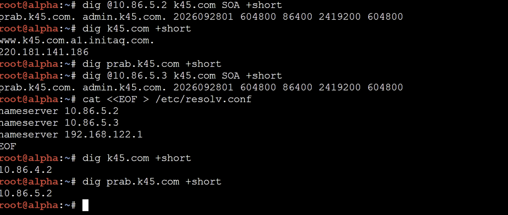

# JARKOM MODUL 2 2026 - K45

## Anggota

| Nama                         | NRP        |
| -------------                | ---------- |
| Abhista Athallah Dyfan       | 5027251006 |
| Rifqi Dwi Muslim             | 5027251077 |

---
 
## Topologi (GNS3)
 
**Daftar node:**
 
| Jumlah | Jenis node       | Node                                                                                              |
| ------ | ---------------- | ------------------------------------------------------------------------------------------------ |
| 14     | Docker (Debian)  | rootkit, alpha, beta, gamma, delta, epsilon, abbey, penny, prab, tedd, obladi, desmond, oblada, molly |
| 7      | Ethernet switch  | Switch1, Switch2, Switch3, Switch4, Switch5, Switch6, Switch7                                     |
| 1      | NAT              | NAT                                                                                               |
 
**rootkit wajib diset punya 6 network adapter (eth0-eth5).** Node lain cukup 1 adapter (eth0, default).
 
**Daftar link:**
 
| Dari (node/eth) | Ke                             |
| --------------- | ------------------------------ |
| rootkit eth0    | NAT                            |
| rootkit eth1    | Switch6                        |
| rootkit eth2    | Switch7                        |
| rootkit eth3    | Switch4                        |
| rootkit eth4    | Switch5                        |
| rootkit eth5    | Switch1                        |
| Switch6         | alpha, beta, gamma             |
| Switch7         | delta, epsilon                 |
| Switch4         | abbey                          |
| Switch5         | penny                          |
| Switch1         | Switch2, Switch3               |
| Switch2         | prab, tedd                     |
| Switch3         | obladi, desmond, oblada, molly |
 

 
---
 
## Rancangan Pengalamatan IP
 
**Prefix kelompok: `10.86.x.x`** dan domain kelompok: **`k45.com`**.
 
Interpretasi topologi: `rootkit` (router pusat) merentang ke **5 switch utama**. Tiap switch = 1 subnet `/24`.
 
| Segmen (Switch)      | Subnet         | Gateway (di rootkit) | Node di segmen ini                              |
| -------------------- | -------------- | -------------------- | ----------------------------------------------- |
| Switch6              | 10.86.1.0/24   | 10.86.1.1            | alpha, beta, gamma                              |
| Switch7              | 10.86.2.0/24   | 10.86.2.1            | delta, epsilon                                  |
| Switch4              | 10.86.3.0/24   | 10.86.3.1            | abbey                                           |
| Switch5              | 10.86.4.0/24   | 10.86.4.1            | penny                                           |
| Switch1 → Switch2/3  | 10.86.5.0/24   | 10.86.5.1            | prab, tedd, obladi, desmond, oblada, molly      |
 
**Alamat IP per node:**
 
| Node    | Hostname     | IP          | Netmask         | Gateway      | Peran                     |
| ------- | ------------ | ----------- | --------------- | ------------ | ------------------------- |
| rootkit | rootkit      | (multi eth) | 255.255.255.0   | -            | Router / NAT / gateway    |
| alpha   | alpha        | 10.86.1.2   | 255.255.255.0   | 10.86.1.1    | Client (pengamat)         |
| beta    | beta         | 10.86.1.3   | 255.255.255.0   | 10.86.1.1    | Client (pengamat)         |
| gamma   | gamma        | 10.86.1.4   | 255.255.255.0   | 10.86.1.1    | Client (pengamat)         |
| delta   | delta        | 10.86.2.2   | 255.255.255.0   | 10.86.2.1    | Client (eksekutor)        |
| epsilon | epsilon      | 10.86.2.3   | 255.255.255.0   | 10.86.2.1    | Client (eksekutor)        |
| abbey   | abbey        | 10.86.3.2   | 255.255.255.0   | 10.86.3.1    | Reverse proxy (static)    |
| penny   | penny        | 10.86.4.2   | 255.255.255.0   | 10.86.4.1    | Reverse proxy (dinamis)   |
| prab    | prab         | 10.86.5.2   | 255.255.255.0   | 10.86.5.1    | DNS ns1 (master)          |
| tedd    | tedd         | 10.86.5.3   | 255.255.255.0   | 10.86.5.1    | DNS ns2 (slave)           |
| obladi  | obladi       | 10.86.5.4   | 255.255.255.0   | 10.86.5.1    | Web statis (area vault)   |
| desmond | desmond      | 10.86.5.5   | 255.255.255.0   | 10.86.5.1    | Web statis (area vault)   |
| oblada  | oblada       | 10.86.5.6   | 255.255.255.0   | 10.86.5.1    | Web dinamis (area core)   |
| molly   | molly        | 10.86.5.7   | 255.255.255.0   | 10.86.5.1    | Web dinamis (area core)   |
 
**Pemetaan interface di rootkit** (urutan `eth` mengikuti urutan penyambungan link di GNS3, **wajib dicek dengan `ip a` lalu sesuaikan**):
 
| Interface | Terhubung ke      | IP           |
| --------- | ----------------- | ------------ |
| eth0      | NAT (WAN)         | dhcp         |
| eth1      | Switch6           | 10.86.1.1    |
| eth2      | Switch7           | 10.86.2.1    |
| eth3      | Switch4           | 10.86.3.1    |
| eth4      | Switch5           | 10.86.4.1    |
| eth5      | Switch1           | 10.86.5.1    |
 
---
 
## Laporan
 
### Soal 1 - Pengalamatan IP dan Default Gateway
 
**Diminta:** memberi IP address dan default gateway ke seluruh entitas (rootkit ke 5 switch, semua client, gerbang, penjaga nama, dan repository) sesuai prefix kelompok `10.86.x.x`.
 
**Konfigurasi interface rootkit** (`/etc/network/interfaces`), bagian internal (WAN/eth0 di soal 2):
 
```sh
cat <<EOF > /etc/network/interfaces
auto eth1
iface eth1 inet static
  address 10.86.1.1
  netmask 255.255.255.0
 
auto eth2
iface eth2 inet static
  address 10.86.2.1
  netmask 255.255.255.0
 
auto eth3
iface eth3 inet static
  address 10.86.3.1
  netmask 255.255.255.0
 
auto eth4
iface eth4 inet static
  address 10.86.4.1
  netmask 255.255.255.0
 
auto eth5
iface eth5 inet static
  address 10.86.5.1
  netmask 255.255.255.0
EOF
 
service networking restart
```
 
**Konfigurasi tiap client** (`/etc/network/interfaces`), contoh **alpha**:
 
```sh
cat <<EOF > /etc/network/interfaces
auto eth0
iface eth0 inet static
  address 10.86.1.2
  netmask 255.255.255.0
  gateway 10.86.1.1
EOF
 
service networking restart
```
 
Sisa node sama polanya, ganti `address` dan `gateway` sesuai tabel:
 
| Node    | address     | gateway     |
| ------- | ----------- | ----------- |
| beta    | 10.86.1.3   | 10.86.1.1   |
| gamma   | 10.86.1.4   | 10.86.1.1   |
| delta   | 10.86.2.2   | 10.86.2.1   |
| epsilon | 10.86.2.3   | 10.86.2.1   |
| abbey   | 10.86.3.2   | 10.86.3.1   |
| penny   | 10.86.4.2   | 10.86.4.1   |
| prab    | 10.86.5.2   | 10.86.5.1   |
| tedd    | 10.86.5.3   | 10.86.5.1   |
| obladi  | 10.86.5.4   | 10.86.5.1   |
| desmond | 10.86.5.5   | 10.86.5.1   |
| oblada  | 10.86.5.6   | 10.86.5.1   |
| molly   | 10.86.5.7   | 10.86.5.1   |
 
**Verifikasi:** cek alokasi IP tiap interface.
 
```sh
ip a
```
 


 
---
 
### Soal 2 - NAT (akses internet lewat rootkit)
 
**Diminta:** buka jalur ke NAT, konfigurasikan interface WAN rootkit dan NAT agar seluruh alamat internal bisa menjangkau internet publik.
 
Tambahkan interface WAN (eth0, dhcp) di rootkit, lalu aktifkan IP forwarding dan masquerade:
 
```sh
cat <<EOF >> /etc/network/interfaces
 
auto eth0
iface eth0 inet dhcp
EOF
 
service networking restart
 
echo 1 > /proc/sys/net/ipv4/ip_forward
 
apt update
which iptables &>/dev/null || apt install iptables -y
 
iptables -t nat -A POSTROUTING -o eth0 -j MASQUERADE -s 10.86.0.0/16
```
 
Penjelasan flag `iptables`:
 
- `-t nat` : tabel NAT untuk translasi alamat outbound
- `-A POSTROUTING` : aturan diterapkan pada paket yang keluar dari sistem
- `-o eth0` : interface keluar (arah NAT/WAN)
- `-j MASQUERADE` : ganti source IP client dengan IP eth0 rootkit
- `-s 10.86.0.0/16` : hanya untuk paket dari subnet internal kelompok
**Verifikasi:** dari rootkit, ping keluar.
 
```sh
ping -c 3 google.com
```
 

 
---
 
### Soal 3 - Routing internal + resolver awal
 
**Diminta:** pastikan seluruh entitas bisa saling terhubung lintas jalur (routing internal via rootkit), dan tiap host non-router menambahkan resolver `192.168.122.1` di `/etc/resolv.conf` agar bisa unduh paket. Jangan pakai resolver Google.
 
Routing internal sudah aktif otomatis setelah rootkit punya IP di semua subnet (soal 1) dan `ip_forward=1` (soal 2). Tinggal set resolver di **tiap node non-router**:
 
```sh
grep -q "nameserver 192.168.122.1" /etc/resolv.conf || echo "nameserver 192.168.122.1" >> /etc/resolv.conf
```
 
**Verifikasi ping antar-subnet** (contoh dari alpha):
 
```sh
ping -c 2 10.86.2.2   # delta (beda subnet)
ping -c 2 10.86.5.2   # prab (beda subnet)
ping -c 2 google.com  # internet lewat NAT
```
 

 
---
 
### Soal 4 - DNS: prab authoritative (ns1) + tedd (ns2)
 
**Diminta:** di **prab**, bangun zona `k45.com` sebagai authoritative dengan SOA menunjuk `prab.k45.com`, tambah NS untuk `prab` dan `tedd`, A record untuk `prab`/`tedd` (ke IP masing-masing) dan A record apex `k45.com` ke gerbang aplikasi dinamis (**penny**). Aktifkan notify dan allow-transfer ke tedd, set forwarders ke `192.168.122.1`. Di **tedd**, tarik zona dari master (slave) dan jawab authoritative. Setelah itu, perbarui urutan resolver semua non-router menjadi: IP prab, IP tedd, lalu 192.168.122.1.
 
**Di prab**, install dan siapkan folder zona:
 
```sh
apt update
apt install bind9 dnsutils -y
mkdir -p /etc/bind/zones
```
 
`/etc/bind/named.conf.options` (prab):
 
```sh
cat <<EOF > /etc/bind/named.conf.options
options {
    directory "/var/cache/bind";
    recursion yes;
    allow-query { any; };
    forwarders { 192.168.122.1; };
    dnssec-validation no;
};
EOF
```
 
`/etc/bind/named.conf.local` (prab), zona forward:
 
```sh
cat <<EOF > /etc/bind/named.conf.local
zone "k45.com" {
    type master;
    file "/etc/bind/zones/db.k45.com";
    allow-transfer { 10.86.5.3; };
    also-notify { 10.86.5.3; };
    notify yes;
};
EOF
```
 
File zona `/etc/bind/zones/db.k45.com` (versi soal 4, nanti ditambah di soal 5 dan 7):
 
```sh
cat <<EOF > /etc/bind/zones/db.k45.com
\$TTL 604800
@   IN  SOA prab.k45.com. admin.k45.com. (
        2026092801  ; Serial
        604800      ; Refresh
        86400       ; Retry
        2419200     ; Expire
        604800 )    ; Negative Cache TTL
;
@       IN  NS  prab.k45.com.
@       IN  NS  tedd.k45.com.
@       IN  A   10.86.4.2       ; apex k45.com -> penny
prab    IN  A   10.86.5.2
tedd    IN  A   10.86.5.3
EOF
 
named-checkconf
named-checkzone k45.com /etc/bind/zones/db.k45.com
service named restart || service bind9 restart
```
 
**Di tedd**, konfigurasi sebagai slave:
 
```sh
apt update
apt install bind9 dnsutils -y
 
cat <<EOF > /etc/bind/named.conf.options
options {
    directory "/var/cache/bind";
    recursion yes;
    allow-query { any; };
    forwarders { 192.168.122.1; };
    dnssec-validation no;
};
EOF
 
cat <<EOF > /etc/bind/named.conf.local
zone "k45.com" {
    type slave;
    masters { 10.86.5.2; };
    file "/var/cache/bind/db.k45.com";
};
EOF
 
named-checkconf
service named restart || service bind9 restart
```
 
**Perbarui resolver semua node non-router** menjadi prab → tedd → 192.168.122.1:
 
```sh
cat <<EOF > /etc/resolv.conf
nameserver 10.86.5.2
nameserver 10.86.5.3
nameserver 192.168.122.1
EOF
```
 
**Verifikasi:**
 
```sh
dig @10.86.5.2 k45.com SOA +short
dig @10.86.5.2 prab.k45.com +short
dig @10.86.5.2 k45.com +short      # harus 10.86.4.2 (penny)
dig @10.86.5.3 k45.com SOA +short  # tedd juga menjawab
```
 

 
---
 
### Soal 5 - Hostname + domain per node
 
**Diminta:** namai semua entitas (hostname) sesuai glosarium, verifikasi tiap host mengenali hostname-nya secara system-wide. Buat domain untuk masing-masing node sesuai namanya (contoh `alpha.k45.com`) dan assign IP masing-masing. Kecualikan node yang bertanggung jawab atas prab dan tedd (sudah ada di soal 4).
 
**Set hostname di tiap node** (contoh alpha, ganti sesuai node):
 
```sh
hostnamectl set-hostname alpha 2>/dev/null || hostname alpha
echo "alpha" > /etc/hostname
grep -q "127.0.1.1 alpha" /etc/hosts || echo "127.0.1.1 alpha" >> /etc/hosts
```
 
**Tambahkan A record semua node ke zona di prab.** Edit `/etc/bind/zones/db.k45.com`, tambahkan blok berikut (setelah baris `tedd`) dan **naikkan serial SOA**:
 
```
; --- soal 5: A record per node ---
rootkit IN  A   10.86.5.1
alpha   IN  A   10.86.1.2
beta    IN  A   10.86.1.3
gamma   IN  A   10.86.1.4
delta   IN  A   10.86.2.2
epsilon IN  A   10.86.2.3
abbey   IN  A   10.86.3.2
penny   IN  A   10.86.4.2
obladi  IN  A   10.86.5.4
desmond IN  A   10.86.5.5
oblada  IN  A   10.86.5.6
molly   IN  A   10.86.5.7
```
 
Setiap kali edit zona, **ubah angka Serial** (misal `2026092801` → `2026092802`) lalu reload:
 
```sh
named-checkzone k45.com /etc/bind/zones/db.k45.com
service named restart || service bind9 restart
```
 
**Verifikasi:**
 
```sh
hostname                       # tiap node menampilkan namanya
dig @10.86.5.2 alpha.k45.com +short
dig @10.86.5.2 molly.k45.com +short
```
 


 
---
 
### Soal 6 - Verifikasi zone transfer
 
**Diminta:** pastikan zone transfer berjalan, tedd menerima salinan zona terbaru dari prab, dan nilai Serial SOA di keduanya sama.
 
Naikkan serial di prab (jika belum), reload, lalu bandingkan serial prab vs tedd:
 
```sh
# di prab (setelah reload)
dig @10.86.5.2 k45.com SOA +short
 
# di tedd (bandingkan serial-nya, harus sama)
dig @10.86.5.3 k45.com SOA +short
 
# cek isi zona penuh yang diterima tedd
dig @10.86.5.3 k45.com AXFR
```
 
Cek juga file slave benar-benar terbentuk di tedd:
 
```sh
ls -l /var/cache/bind/db.k45.com
```
 


 
---
 
### Soal 7 - Reverse proxy nodes, A record web, dan CNAME
 
**Diminta:** tetapkan peran abbey/penny sebagai gerbang, obladi/desmond web statis, oblada/molly web dinamis. Tambahkan A record `vault.k45.com` (IP obladi & desmond) dan `core.k45.com` (IP oblada & molly). Tetapkan CNAME `www.k45.com` → `penny.k45.com` dan `static.k45.com` → `abbey.k45.com`. Verifikasi dari dua klien berbeda bahwa semua hostname resolve konsisten.
 
Tambahkan ke `/etc/bind/zones/db.k45.com` di prab (dan **naikkan Serial**):
 
```
; --- soal 7: web endpoints ---
vault   IN  A       10.86.5.4      ; obladi
vault   IN  A       10.86.5.5      ; desmond
core    IN  A       10.86.5.6      ; oblada
core    IN  A       10.86.5.7      ; molly
www     IN  CNAME   penny.k45.com.
static  IN  CNAME   abbey.k45.com.
```
 
Reload:
 
```sh
named-checkzone k45.com /etc/bind/zones/db.k45.com
service named restart || service bind9 restart
```
 
**Verifikasi dari dua klien berbeda** (contoh alpha dan delta):
 
```sh
dig vault.k45.com +short     # dua IP: 10.86.5.4 & 10.86.5.5
dig core.k45.com +short      # dua IP: 10.86.5.6 & 10.86.5.7
dig www.k45.com +short       # -> penny.k45.com -> 10.86.4.2
dig static.k45.com +short    # -> abbey.k45.com -> 10.86.3.2
```
 


 
---
